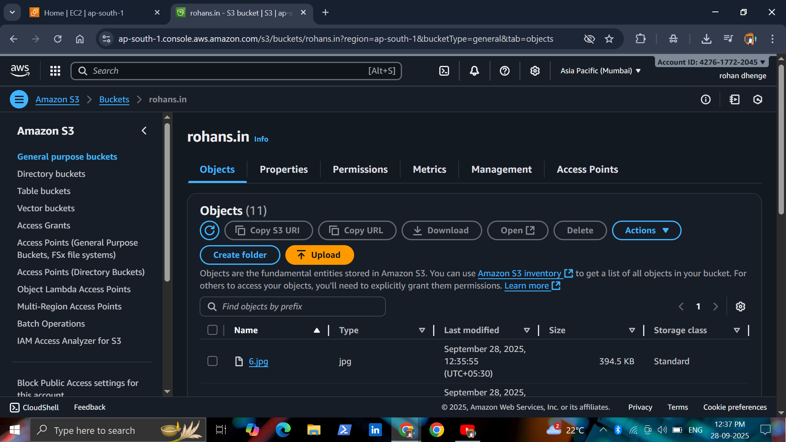
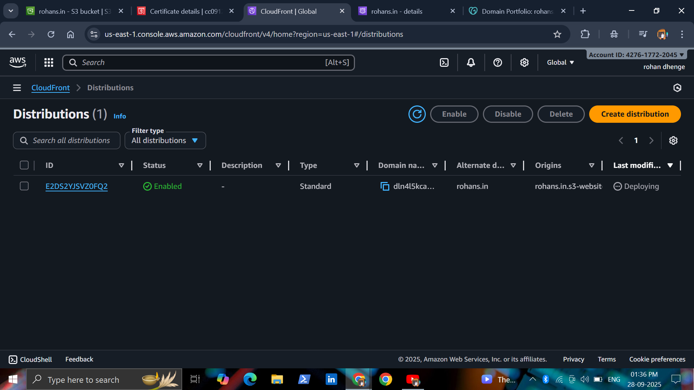

# AWS Static Website Hosting with S3, CloudFront, Route 53, and ACM

## Introduction
This project demonstrates how to host a **static website** on **AWS** using **S3**, **CloudFront**, **Route 53**, and **AWS Certificate Manager (ACM)** for secure HTTPS access.  

**Key Features:**
- Fully hosted static website on Amazon S3
- Secure HTTPS access using ACM
- Global content delivery via CloudFront CDN
- Custom domain management with Route 53
- Highly available and scalable solution

---

## Architecture Diagram

---

## Steps to Deploy

### 1. Create S3 Bucket
- Go to S3 console
- Create a bucket with your domain name (e.g., `rohans.in`)
- Enable **Static Website Hosting**
- Upload website files (`index.html`, etc.)
- Set proper bucket permissions (public read)

### 2. Request SSL Certificate with ACM
- Go to **AWS Certificate Manager**
- Request a public certificate for domain ('rohans.in')
- Validate domain using **DNS validation** via Route 53

### 3. Configure CloudFront Distribution
- Origin: S3 bucket (static website endpoint)
- Enable HTTPS using the ACM certificate
- Set **Default Root Object** as `index.html`
- Enable caching and optimizations as needed

### 4. Setup Route 53
- Create a **Hosted Zone** for domain
- Add **A record** (Alias) pointing to the CloudFront distribution
- Wait for DNS propagation
.png)
### 5. Test Website
- Open domain in a browser (rohans.in)
- Verify website loads securely via HTTPS
- Check caching via CloudFront

## Technologies Used
- **AWS S3** – Static Website Hosting  
- **AWS CloudFront** – Content Delivery Network  
- **AWS Route 53** – Domain Name System  
- **AWS ACM** – SSL/TLS Certificates  

---

## Author
**Rohan Ramesh Dhenge**  
Email: rohandhenge8680@gmail.com  
LinkedIn: [https://www.linkedin.com/in/rohan-dhenge](https://www.linkedin.com/in/rohan-dhenge)

